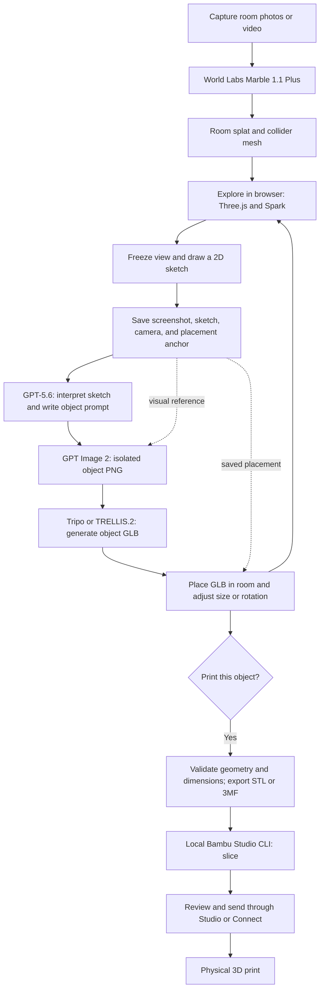

# Print the World

Hackathon concept, architecture, and API research · September 5, 2026

## The idea

Capture the room you are standing in, explore a generated 3D version of it, and sketch objects into your view. AI turns each sketch into an isolated object image, then a 3D model that appears in the room. If you like the object, prepare it for a physical 3D print.

Example: walk around a digital version of your room, draw a plant pot beside a desk, and type “a small terracotta planter with vertical ribs.” Generate it, adjust its placement and dimensions, inspect it from different angles, and print a suitable version. A couch follows the same visualization workflow; printing it would mean a miniature or separately designed components.

**Recommended MVP:** a laptop browser app using **React/TypeScript + Three.js + Spark**, **World Labs Marble 1.1 Plus** for the room, **GPT-5.6 Sol** for interpreting the sketch, **GPT Image 2** for the object image, and **Tripo H3.1** for the object mesh. The review recommends **Convex** for project state, provider jobs, and asset storage, with a **local Node print worker** for Bambu Studio CLI and a Studio/Connect handoff for print initiation. Keep the original local Node/SQLite backend as the fallback if Convex setup blocks the first working loop. Hosted **TRELLIS.2 on fal** is a contingency, not a second required implementation.

These recommendations prioritize integration fit for this hackathon. They are based on public vendor documentation, not a measured comparison of output quality. Account access, latency, and printer compatibility still need a small end-to-end trial.

## Architecture review and scope decisions

Review baseline: commit `2123967`. These additions specify implementation defaults and proposed scope changes; they do not establish that the integrations or accuracy tests have passed.

| Area | Agreement / change from the earlier architecture discussion |
| --- | --- |
| World Labs room + separate Tripo object | Agree. Keep the room fixed while users iterate on independently editable objects. |
| Sketch → isolated image → mesh | Keep the spec's more explicit image-conditioning step. A sketch must actually reach the image API, and the approved cutout must reach Tripo. |
| Three.js + Spark owns composition | Keep. This is better supported than the earlier suggestion to rely on Mint for arbitrary object insertion into a saved room. |
| Backend | Original spec chose local Node/SQLite and omitted Convex. Recommend Convex for shared state and provider jobs; keep machine-specific slicing local. Choose one authoritative backend for the demo, without dual writes. |
| Accuracy | Add calibration, an independent measurement check, explicit object dimensions, and versioned validation. Generated metric metadata alone is insufficient evidence of physical fit. |
| Print versus order | The original product asks for direct ordering; this spec only defines local printing. Preserve ordering as a product requirement, but track its missing fulfillment provider and quote/checkout contract explicitly below. |
| Scope | Prioritize one laptop, one room, floor/table placement, and one small printable object. Mobile navigation, arbitrary wall mounting, a second mesh provider, and unattended dispatch are stretch work. |

**Track recommendation:** Physical AI & Simulation, with a measured placement and print demonstration. If the result remains visual generation and export without measured physical validation, Creative 3D & VFX is the clearer fit. The public event page lists two winners per track and no minimum sponsor count; detailed eligibility and judging criteria remain unconfirmed from the kickoff. Record any organizer clarification here with its source. [Official event](https://luma.com/b101ml40).

**Sponsor priorities:** World Labs generates the room, Tripo generates the object, and Convex persists the working experience. Mint is optional pending a demonstrated capture or asset workflow that helps the demo. Do not assume use through an intermediary counts toward another sponsor's eligibility. This is a build recommendation, not a published judging rule.

## Application flow

Room generation happens once per capture. Object generation repeats while the same room remains loaded. The app saves a scene containing the original splat plus separate object meshes and their transforms.

## API and tool choices

| Component | Recommended choice | Why it fits / limitation |
| --- | --- | --- |
| Room generation | World Labs `marble-1.1-plus` | Latest documented Marble model; listed in the public World API. `marble-1.1` is a fixed-cost alternative. Explicitly set the model because the documented API default remains older. [Model mapping](https://docs.worldlabs.ai/api/models), [model descriptions](https://docs.worldlabs.ai/marble/models). |
| Room rendering and object composition | Three.js + `@sparkjsdev/spark` | Spark integrates splats into a Three.js scene. Load object GLBs with Three.js `GLTFLoader`. [Spark](https://sparkjs.dev/docs/), [GLTFLoader](https://threejs.org/docs/pages/GLTFLoader.html). |
| Sketch interpretation | OpenAI `gpt-5.6-sol` | Supports image inputs and structured outputs through Responses. The `gpt-5.6` alias maps to Sol. [Model documentation](https://developers.openai.com/api/docs/models/gpt-5.6-sol). |
| Object image | OpenAI `gpt-image-2` | Latest documented GPT Image model. Transparent backgrounds are available in **preview**; request the API setting explicitly. [Image generation guide](https://developers.openai.com/api/docs/guides/image-generation). |
| Object mesh | Tripo H3.1, `v3.1-20260211` | Supports image-to-model, source-image orientation alignment, and geometry controls. Its conversion API supports STL and 3MF. [H3 parameters](https://docs.tripo3d.ai/model-generation/image-to-model-v3-0-v3-1.html), [conversion](https://docs.tripo3d.ai/export/conversion.html). |
| Alternative object mesh | `fal-ai/trellis-2` | Hosted image-to-GLB endpoint with queue support; avoids maintaining a GPU environment. [API](https://fal.ai/models/fal-ai/trellis-2/api). |
| Project state and generation jobs | Convex | Recommended review change: mutations record intent, scheduled actions call providers, and queries update the UI. Store captures and completed outputs in file storage. Local Node/SQLite remains a fallback. [Actions](https://docs.convex.dev/functions/actions), [storage](https://docs.convex.dev/file-storage/overview). |
| Optional platform | Mint | The freshly fetched API overview describes **Mint account** access through API keys, superseding the older beta-only description. Account access still needs testing. API assets do not automatically create a Mint chat or personal Project; our app owns scene organization. [Mint API](https://docs.mint.gg/developers/api-overview). |
| Print preparation | Local Bambu Studio CLI | Documents slicing and 3MF export. Treat printer dispatch as a separate integration. [CLI documentation](https://github.com/bambulab/BambuStudio/wiki/Command-Line-Usage). |

**Why Tripo first:** its alignment and export controls match the two difficult transitions: putting the generated asset back into the saved view and preparing a print file. Complete one Tripo run first. Test TRELLIS.2 with the same image only if Tripo access, latency, or output quality blocks that run.

**Why Spark for insertion:** the object can remain an ordinary editable mesh in the same scene as the splat. No additional generation API is needed to “merge” it into the room. World Labs also documents interactive examples combining splats, dynamic meshes, controllers, and physics. [Interactive world examples](https://docs.worldlabs.ai/api/interactive-world-examples).

**Where Mint could help:** its mobile app offers guided room photos and a guided video sweep. This could simplify capture if already available to the team. Its documented generation API does not, by itself, establish an embeddable editor for inserting arbitrary GLBs into our own saved room; our app should own that composition. [Mobile capture](https://docs.mint.gg/mobile-capture), [API overview](https://docs.mint.gg/developers/api-overview).

**Why avoid local TRELLIS.2 for this MVP:** Microsoft's reference implementation is tested on Linux and requires an NVIDIA GPU with at least 24 GB VRAM. Its published timing measurements are on an H100, not a laptop or a hosted-service latency guarantee. [Official TRELLIS.2 repository](https://github.com/microsoft/TRELLIS.2).

## The nine-step experience

### 1. Capture the hackathon room

Start with an iPhone video uploaded to the laptop app. Record a steady sweep from one useful location, covering the area where the demo will happen. Keep exposure and zoom fixed and minimize moving people in frame. World Labs recommends continuous, rotation-focused capture covering 180–360 degrees. [Video guidance](https://docs.worldlabs.ai/marble/create/prompt-guides/video-prompt).

Target an MP4 of at most 30 seconds and 100 MB, matching the published Marble input guidelines; validate the selected API's accepted upload constraints during integration. A full panorama must be a 360-degree equirectangular image, not an ordinary partial phone panorama. [Input specifications](https://docs.worldlabs.ai/marble/create/prompt-guides).

Keep a few sharp stills as a fallback. Multi-image input works best when the views describe the same space with overlap. Hidden areas can be generated plausibly, so a walkable result should be treated as a visual approximation of the room. Check recognizable furniture and measure one reference distance before relying on scale. [Multi-image guidance](https://docs.worldlabs.ai/marble/create/prompt-guides/multi-image-prompt).

### 2. Generate and store the room

The backend uploads the capture, starts a world-generation job, and polls until completion. Save the world ID, selected model, original input, and returned assets. The World API provides SPZ splats at several resolutions and a GLB collider mesh. Start with the 500k splat on the laptop and try the 100k version on the phone. [World API quickstart](https://docs.worldlabs.ai/api).

Normalize the room before placing anything. Marble returns `metric_scale_factor` and `ground_plane_offset`; apply these to splat positions and sizes using the documented formula, then apply the renderer's axis conversion. Its viewer uses a 180-degree X rotation for generated SPZ assets. Save this transform with the project. Verify collider alignment separately so a mesh already in a different export frame is not transformed twice. [SPZ rendering guidance](https://docs.worldlabs.ai/api/rendering-spz).

The room's collider is useful for picking surfaces and walking constraints. Detailed textured room-mesh export is unnecessary for the core demo.

### 2a. Coordinate and accuracy contract

Use a right-handed application frame with **meters**, **+Y up**, camera local forward **−Z**, quaternions serialized as `[x,y,z,w]`, and matrices serialized as column-major 16-number arrays. Store separate `splatToApp` and `colliderToApp` matrices and an immutable `worldTransformVersion`. Apply provider scale/ground normalization and axis conversion exactly once at import. Check three recognizable collider/splat landmarks before enabling picking. Missing scale metadata means the room is uncalibrated, not that one raw unit is one meter.

Calibration is a UI operation before claiming measured placement:

1. Select two recognizable points on the room collider and enter their physically measured separation in millimeters. Show the picked points for correction.
2. For their current application positions `a,b`, set `k = (referenceDistanceMm / 1000) / length(b-a)`. Reject nonpositive, nonfinite, or coincident-point input. Apply this uniform correction about the room origin to the room frame; scale camera positions and existing anchors with it, preserving explicitly chosen object dimensions.
3. Measure a **different** span near the placement area and compare it with the calibrated scene. Store both distances and the absolute/relative error. Reusing the first span proves only that the scale formula was applied.
4. Proposed demo target: independent-span error at most `max(20 mm, 5% of measured span)`. This is a coarse room-scale target, not a printer tolerance or a proven result. If it fails, show “approximate room scale” and require direct physical measurements of the intended available space.

Persist calibration points, reference and check measurements, correction factor, timestamp, and transform version. A recalibration must retain the old version for saved sketches, or mark those sketches stale and require re-anchoring. Do not silently reinterpret an old camera/anchor using a new frame. One global scale correction cannot fix local reconstruction distortion or generated hidden geometry.

### 3. Explore, then draw on the screen

Use a React/TypeScript interface with a Three.js canvas and a transparent 2D canvas above it. This is a proposed implementation, not a provider requirement.

- **Explore:** mouse look and keyboard movement on laptop; touch look and a movement control on phone.
- **Draw:** freeze the camera, release pointer lock, and route input to the overlay. Provide pen, eraser, undo, and clear.
- **Generate:** attach an optional short description and submit the saved sketch.
- **Adjust:** move, rotate, resize, delete, or regenerate the resulting object.

Keep each sketch attached to one frozen view. Resizing the viewport should preserve its original dimensions and stroke coordinates. Start with simple navigation; add collider-based walking if time permits.

Support all three input modes: **sketch only**, **text only**, and **sketch + text**. Text-only users click a placement anchor and enter dimensions; an empty sketch is valid when text is present. Reject a submission with neither. The first demo supports upright objects on a floor or tabletop; wall/ceiling attachment and articulated interactions are stretch goals. “Interact” in the MVP means walk/orbit, select, move, rotate, resize, delete, and regenerate.

### 4. Save the view and drawing

Save the composited screenshot the user described, plus enough information to restore it and place an object later:

| Saved field | Purpose |
| --- | --- |
| `worldId` and world transform/version | Identifies the room and its coordinate frame. |
| Clean scene image | Preserves context without marks. |
| Transparent sketch PNG and stroke data | Keeps the intended shape separate from existing furniture. |
| Composite PNG | Exact view with drawing for model interpretation and history. |
| Camera position, quaternion, projection matrix/FOV | Restores the original perspective. |
| Viewport dimensions and device pixel ratio | Maps drawing pixels back to camera rays. |
| Sketch bounds and a chosen contact point | Indicates object extent and where it should touch a surface. |
| Placement anchor, surface normal, and anchor method | Supplies depth and supports repeatable positioning. |
| User text and intended dimensions, if known | Preserves intent independently of AI-generated wording. |

Capture the scene and overlay at the same resolution and frame. Use a deliberate render capture; confirm it includes both splats and previously placed objects. Store the composite as a reference image, not as the only project state.

Store stroke points and the contact point in normalized image coordinates `[0,1]` measured from the top left, together with the original pixel dimensions. Map a point `(u,v)` to ray coordinates `(2u-1, 1-2v)` using the **saved** camera. Account for the canvas's screen offset and any letterboxing when recording pointer input; do not multiply normalized coordinates by device pixel ratio. Save `sceneRevision` with the capture so later object edits cannot change the reference for an in-flight job.

### 5. Interpret the sketch and generate the object image

Send the composite, separate sketch, and user text to GPT-5.6 Sol. Ask for structured output containing `object_description`, `image_prompt`, `support_surface`, `suggested_dimensions_m`, and `uncertainties`. Suggested dimensions are a starting point; the user controls final size.

Make `support_surface` an enum (`floor`, `table`, `wall`, `unknown`) and dimensions either `null` or `{width, height, depth}` with finite positive values. `uncertainties` is an array of short strings. Interpret dimensions as object-local X/Y/Z bounds; never invent an anchor coordinate in this response. Explicit user measurements take precedence over AI suggestions. Handle refusals, incomplete responses, and invalid schema output as a failed interpretation stage with a visible retry/edit path.

Then call the Images edit endpoint with the visual reference and generated prompt, so the drawing actually conditions the image. Use `model: "gpt-image-2"`, `background: "transparent"`, `output_format: "png"`, and initially `size: "1024x1024"`. Omit `input_fidelity` for this model. [Image API guidance](https://developers.openai.com/api/docs/guides/image-generation).

Proposed prompt pattern:

> Create one isolated object matching the user's sketch: {description}. Use the room only to understand style and the intended object. Show the complete object in a clear three-quarter product view, centered with margin. Preserve the sketch's defining silhouette and proportions. Use a transparent background. Exclude the room, floor, other furniture, text, and cast shadows.

Show the image for review before the 3D step. Check the decoded alpha channel: a checkerboard painted into an opaque image is not transparency. If needed, remove the background with a separately tested segmentation step and review the silhouette. The saved room screenshot remains the context; the isolated cutout becomes the 3D model input. A small rotation adjustment may be necessary because a product view differs from the original camera view.

Use `quality: "medium"` for the initial reviewed image. Keep the clean room image, composite, and sketch as labeled references; a stroke overlay is not automatically an Images API edit mask. Approving an image freezes its asset ID and hash for mesh generation. Text-only requests use the text plus clean room reference. If transparency is unavailable for the account, return a visible image-stage error or use a tested background-removal fallback; do not repeatedly regenerate without user intent. These defaults follow the checked [OpenAI image guide](https://developers.openai.com/api/docs/guides/image-generation).

### 6. Turn the image into a 3D object

Send the generated **image**, rather than just its text prompt, to image-to-3D. The result should be an object mesh, not a reconstruction of the entire screenshot.

For Tripo, start with H3.1, texturing enabled, standard quality, and `orientation: "align_image"`. This aligns to the supplied object image, not automatically to our room camera. Keep the GLB for display and create an STL/3MF derivative only when printing. [Image-to-model parameters](https://docs.tripo3d.ai/model-generation/image-to-model-v3-0-v3-1.html).

For fal's TRELLIS.2 alternative, the contract is `image_url` in and `model_glb.url` out. Its queue API supports asynchronous jobs. Begin with reduced mesh complexity for the browser and retain a higher-detail version if available. [Hosted TRELLIS.2 API](https://fal.ai/models/fal-ai/trellis-2/api).

Copy completed assets into project storage promptly. Tripo's task-result documentation says its model download URLs expire after five minutes by default; persisting only those URLs would break saved projects. [Task results](https://docs.tripo3d.ai/task-query/get-your-task-result.html).

### 7. Place the GLB in the room

This is application geometry work. A screenshot and camera pose define a viewing ray, but they do not uniquely specify distance.

Proposed placement algorithm:

1. Before generation, let the user choose the sketch's base/contact point.
2. Cast a ray from the saved camera through that point into the collider mesh. Save the hit position and surface normal.
3. If the collider hit is missing or wrong, offer a floor plane or manual distance adjustment. Spark also supports splat raycasts, but these are approximate and can be expensive on large scenes. [SplatMesh raycasting](https://sparkjs.dev/docs/splat-mesh/).
4. Normalize the object's axes and pivot. Place its bottom center at the saved anchor.
5. Use the selected dimensions to scale the model. When dimensions are unknown, estimate initial size from sketch bounds and anchor depth.
6. Provide explicit translation, rotation, and scale controls to correct the result.
7. Persist the final transform, asset ID, and original sketch ID.

For the MVP, accept an automatic anchor only when its surface normal is within 15° of +Y and the user confirms the visible marker. Otherwise request a floor/table anchor. Normalize the mesh into an object-local frame with a bottom-center pivot and record its original bounds. Lock aspect ratio by default: a height change uses one uniform scale and derives width/depth. Independent-axis resizing must be an explicit unlock because it changes shape. An AI size estimate is always labeled estimated until the user confirms it.

Show measured width/height/depth in the adjustment panel. Optionally let the user define a simple available-space box using physical measurements. A green result means “fits measured box” only when every object vertex, transformed into that box's frame, lies within its bounds and configured margin. This checks containment, not stability, load capacity, or arbitrary room collisions. Collision against generated room geometry remains approximate; no green “verified real-world fit” status follows from a coarse collider alone.

Keep splats, collider, camera, and objects in a documented common coordinate system. Test near a desk or wall: matching transforms is not sufficient by itself to guarantee convincing occlusion. Tune mesh/splat depth behavior and inspect silhouettes; add a carefully configured depth proxy only if needed. Spark exposes depth/compositing controls and scene capture facilities. [SparkRenderer](https://sparkjs.dev/docs/spark-renderer/).

### 8. Inspect and keep editing

The user walks around the object, returns to the original sketch view, changes its dimensions, or generates another version. Store each accepted object separately so deleting or replacing one does not affect the room.

For a fast-feeling demo, show the sketch immediately, then the isolated image while the mesh job runs. A temporary image card can be shown at the anchor, clearly labeled as a preview. Replace it with the GLB when ready. Reopening a project must restore the objects without rerunning any generation.

### 9. Prepare and print a physical version

The **Print** action starts a preparation workflow: choose dimensions in millimeters, validate geometry, export a printable mesh, slice with the actual printer/material profile, review the result, and initiate the print.

An attractive generated mesh is not automatically a functional planter. Check for a hollow interior, adequate wall and base thickness, a stable base, and intentional drainage. For the demo, choose a small simple object and inspect the sliced layers. Keep the printable derivative separate from the visual GLB, and preview any geometry changes back in the app.

Tripo can convert to STL or geometry-only 3MF; STL drops textures. Conversion alone does not establish printability. Apply the chosen object scale deliberately and verify units after export. [Conversion API](https://docs.tripo3d.ai/export/conversion.html).

A browser cannot directly execute a desktop CLI. Run a small local backend on the laptop to invoke Bambu Studio with fixed, validated arguments. The CLI supports profiles, orientation, arrangement, slicing, and 3MF export. Test the installed binary with `--help` and a known object before integrating generated meshes. [Bambu Studio CLI](https://github.com/bambulab/BambuStudio/wiki/Command-Line-Usage).

**MVP handoff:** the app prepares the file and opens it in Bambu Studio for review and sending. Bambu Connect is another documented route for delivering sliced files and initiating prints; availability and integration depend on the actual printer/software setup. Fully automatic dispatch is a stretch goal requiring a tested supported path, not an assumed CLI `--print` option. [Bambu integration documentation](https://blog.bambulab.com/firmware-update-introducing-new-authorization-control-system-2/).

### 9a. Print acceptance and export contract

`PrintArtifact` is immutable and references the source object asset, accepted geometry revision, print dimensions, and validation report. Export **only the selected object**: bake its local geometry and chosen scale, omit its room position and room meshes, and place the print at the build-plate origin. Scene orientation and print orientation are separate fields. Convert meters to millimeters exactly once. STL has no unit metadata; require millimeters in the manifest and slicer import. Geometry 3MF must declare millimeters and is distinct from a sliced printer job.

| Check | Required evidence / behavior |
| --- | --- |
| Dimensions and units | Re-import the exported file and compare all three bounds in the object's normalized local frame, undoing any saved print rotation, to the chosen print dimensions. Proposed numeric acceptance: within `max(0.1 mm, 0.1% of target dimension)` per axis. This verifies export math, not physical printer accuracy. |
| Mesh validity | Check finite vertices, nonempty triangles, nonzero volume, closed manifold topology, consistent winding, and self-intersections. Each result is `pass`, `fail`, or `not_checked`; an unsupported check must not silently pass. |
| Functional geometry | For the planter, explicitly inspect cavity, base, wall thickness, and drainage. Record the checked method and printer/material-specific minimum wall/base values. If thickness analysis is unavailable, require recorded manual/slicer inspection before declaring it ready. |
| Printer suitability | Verify the sliced orientation fits the actual usable build volume; inspect supports, disconnected islands, first layer, material, nozzle, and time estimate in the selected profile. |
| Revision integrity | Any geometry or size change creates a new artifact and invalidates old validation, slicing, and quotes. A room-only translation does not invalidate the print geometry. |

A failed generated planter is still a visual prototype. The fallback is a simple approved object that slices successfully, or a separately labeled parametric planter derivative with explicit wall/base dimensions. Show and approve that derivative in the app before printing; record its provenance rather than presenting it as the unchanged generated mesh. Do not add arbitrary mesh hollowing to the critical path.

### 9b. Direct ordering: required product extension, unresolved integration

Local printing does not fulfill the original “can directly be ordered” requirement. Preserve two distinct actions: **Prepare local print** and **Order a print**. The latter needs a selected fulfillment vendor with a tested upload/quote/checkout path; no vendor is established in this repository yet.

Define an ordering adapter with `requestQuote(printArtifactId, material, quantity, shippingRegion)` returning a vendor quote ID, currency, item/shipping/tax/total amounts when available, expiry, and checkout URL. Bind the quote to the artifact hash and dimensions. The user reviews the vendor's final price and confirms checkout; persist the resulting order ID and status only after provider confirmation. Use vendor idempotency support or reconcile uncertain submissions before retrying. If integration is unavailable, expose export and clearly mark ordering unavailable; a local download or an internally saved request is not a placed order.

## Backend boundaries and API contracts

**Recommended revision:** use Convex as the authoritative project/job store, with file storage for captures and copied outputs. A mutation records each generation request and schedules provider work; actions submit or poll one stage and save progress through mutations; subscribed queries update the UI. Upload large capture/model files through storage upload URLs rather than passing binary data through ordinary function arguments. Keep provider keys in backend environment variables. [Convex actions](https://docs.convex.dev/functions/actions), [file uploads](https://docs.convex.dev/file-storage/upload-files).

Keep Bambu Studio and any native mesh preparation in a local Node/TypeScript worker on the printer laptop. For a hosted frontend, the worker makes outbound authenticated requests to claim queued print-preparation jobs and report results; the cloud cannot directly execute the laptop binary. Each claim has a worker ID and lease. Expired leases may retry preparation, but never automatically repeat physical dispatch. Validate project/worker access and use fixed argument arrays with `shell: false`, configured printer profiles, and a per-job temporary directory. The initial handoff may simply download the artifact for manual opening in Studio; the worker is required for integrated CLI slicing, not for basic export.

**Fallback:** if Convex cannot pass create-project/upload/reload within a 30-minute setup timebox, use the original local Node/SQLite + file-storage design for the laptop demo and note the choice here. Use the same logical records and commands below. Do not build both backends or try to synchronize their databases during the hackathon. In local mode, provider-readable media needs a tested upload path; a localhost file URL is not accessible to a hosted generation service.

| Service | Documented interaction |
| --- | --- |
| World Labs | Base `https://api.worldlabs.ai`; authenticate with `WLT-Api-Key`. Prepare an upload, submit `POST /marble/v1/worlds:generate`, poll `GET /marble/v1/operations/{id}`, and retrieve the world. [Quickstart](https://docs.worldlabs.ai/api). |
| OpenAI interpretation | `POST /v1/responses` with `gpt-5.6-sol`, image inputs, and a structured output schema. [Model](https://developers.openai.com/api/docs/models/gpt-5.6-sol). |
| OpenAI image | `POST /v1/images/edits` with reference image(s), generated prompt, and transparent PNG options. [Guide](https://developers.openai.com/api/docs/guides/image-generation). |
| Tripo | The established task API uses `POST https://api.tripo3d.ai/v2/openapi/task`, Bearer authentication, and `GET /v2/openapi/task/{id}`. Select `type: "image_to_model"` with H3.1. [Authentication and tasks](https://docs.tripo3d.ai/get-started/quick-start.html). |
| fal alternative | Submit `fal-ai/trellis-2` with the server SDK; persist the request ID, poll status, and retrieve the result. [API](https://fal.ai/models/fal-ai/trellis-2/api). |

Tripo also publishes a v3 developer surface. Choose one documented API family and keep its request fields and response parser together; do not mix the v2 `model_version` task payload with v3 examples using `model`. [v3 image-to-model documentation](https://developers.tripo3d.ai/en/docs/generation-image-to-model).

Required internal records are specified below. Store provider IDs, model versions, timestamps, settings, errors, and durable asset storage IDs; filesystem paths belong only to the local fallback/worker. The frontend subscribes to Convex queries, or polls the local server in fallback mode, instead of holding one long request through every stage.

| Record | Minimum fields beyond ID and timestamps |
| --- | --- |
| `Project` | owner/session ID, active world ID, scene revision, backend mode |
| `World` | project ID, capture asset IDs, provider operation/world IDs, splat/collider asset IDs, both import transforms, transform version, calibration and independent-check result |
| `Sketch` | project/world IDs, immutable world-transform and scene revisions, input mode, camera, viewport, normalized strokes/contact point, reference asset IDs, anchor/normal/method, user text, confirmed dimensions |
| `GenerationJob` | project/sketch ID, stage, status, provider/model, provider job ID, request key/hash, attempt, output asset IDs, timestamps, error/retryability, worker lease if applicable |
| `ObjectAsset` | project ID, source sketch/image/job IDs, durable GLB asset ID, hash, normalization transform, local bounds, geometry revision |
| `SceneObject` | project ID, object asset ID, anchor, position, quaternion, positive scale, confirmed dimensions, object revision |
| `PrintArtifact` | source object/geometry revision, file asset ID/hash, dimensions in mm, print orientation, validation report with method/version/status per check |
| `PrintJob` | artifact ID/hash, printer/material/profile versions, worker claim, preparation status, sliced asset ID, review/handoff/dispatch evidence |
| `Order` (when integrated) | artifact hash, vendor, quote ID/expiry/currency/amounts, checkout URL, confirmed order ID/status |

Expose these logical commands through Convex functions, or equivalent local HTTP endpoints: `createProject`, `startWorld`, `saveCalibration`, `saveSketch`, `startImage`, `approveImageAndStartMesh`, `updateSceneObject`, `preparePrint`, and `requestQuote` when implemented. Generation commands return `{jobId}` immediately. `updateSceneObject` requires `expectedRevision` to detect stale edits. All commands validate ownership/session access and return structured `{code, message, retryable}` errors. Use a single authenticated team project for the demo; full account onboarding and multiplayer presence are stretch work.

### Job lifecycle and recovery

Use separate stages `room`, `interpretation`, `image`, `mesh`, `asset_copy`, `validation`, and `slice`. Each stage has `queued`, `running`, `awaiting_review`, `succeeded`, `failed`, `submission_unknown`, or `canceled` status. Image approval starts the mesh stage. A completed provider job is not browser-ready until its required assets have been copied and checked. Rendering readiness and print readiness are distinct. Record print preparation as `queued → preparing → awaiting_review → handed_off`; `dispatched` and `completed` require printer evidence or explicitly labeled operator confirmation. A successful file-open operation proves only handoff.

Deduplicate explicit user actions with a persisted request UUID plus payload hash and stage; a changed payload gets a new request. Atomically claim jobs before contacting providers. Persist the returned provider ID immediately. If a create request times out after it may have been accepted, use provider-supported idempotency/reconciliation; otherwise mark `submission_unknown` and require an explicit potentially chargeable retry. A local UUID alone does not guarantee exactly-once behavior at an external API.

Poll with backoff starting at 2 seconds and capped at 10 seconds, with jitter and provider `Retry-After` handling. A soft timeout (initially 10 minutes for room/mesh, 3 minutes for image) shows a delayed state and allows checking the existing job; it does not start another paid generation. Retry transient polling/download failures up to three times, retaining successful stages. Request a fresh result URL if an asset URL expires. If the user cancels while the provider keeps running, ignore late scene insertion and explain that provider work may still incur cost. Preserve outputs as history if the originating object was deleted or revised while work was running.

Persist successful stages independently. Retry from the failed stage, and avoid duplicate paid jobs when a client reconnects. Treat print submission separately: a network retry must not accidentally dispatch a second physical print.

For iPhone access, serve the same responsive interface from the laptop or a hosted backend. File upload can be the initial capture path; direct browser camera capture needs an appropriate secure origin. Native iOS/AR features can follow once the laptop loop works.

## Cost and latency planning

Published prices below were checked September 5, 2026. They exclude retries, storage, and physical printing.

These are estimates inherited from the initial research, not account quotes or measured usage. The architecture review checked the selected OpenAI model/image options, World Labs model mapping and scale handling, Tripo result retention, Mint access wording, and Convex boundaries; it did not re-audit every price or run paid generation. Confirm access with the team's actual API accounts and record latency/cost from the first successful run before committing the remaining build time.

| Stage | Published cost / planning note |
| --- | --- |
| Marble 1.1 Plus, video or multi-image | 1,600–3,100 API credits, or **$1.28–$2.48** at 1,250 credits/$1. World API credits are separate from Marble app credits. [API pricing](https://docs.worldlabs.ai/api/pricing). |
| GPT-5.6 Sol | Currently $4/M input tokens and $20/M output tokens; actual cost depends on image input and response usage. [Model pricing](https://developers.openai.com/api/docs/models/gpt-5.6-sol). |
| GPT Image 2, 1024-square output | Output-only reference prices: **$0.006 low, $0.053 medium, $0.211 high**. Add text/image input usage. [Image cost table](https://developers.openai.com/api/docs/guides/image-generation). |
| Tripo H3 image-to-model | **$0.20 without texture / $0.30 with texture** at 100 credits/$1. Extra settings can add charges; conversion starts at $0.05. [Pricing](https://docs.tripo3d.ai/get-started/pricing.html). |
| fal TRELLIS.2 alternative | **$0.25 / $0.30 / $0.35** for 512/1024/1536 resolution settings. [Provider pricing](https://fal.ai/models/fal-ai/trellis-2). |

For a medium image plus standard textured Tripo generation, the published base is about **$0.353 per attempt**, before OpenAI input/interpretation costs and any conversion. This is a planning subtotal, not a quoted all-in price.

World Labs' quickstart suggests roughly five minutes for world generation. OpenAI notes that complex image requests can take up to two minutes. No end-to-end timing was tested here. Budget minutes for the complete object loop until measured, and generate the demo room ahead of the presentation. [World generation](https://docs.worldlabs.ai/api), [image limitations](https://developers.openai.com/api/docs/guides/image-generation).

## Build order and completion criteria

1. **Validate dependencies:** confirm API access/credits, choose the authoritative backend, capture the room, generate one world, and obtain one sample GLB. Check the actual printer model, nozzle, filament, and Bambu Studio installation. Start a small slice/print trial early enough to finish before judging; hardware availability is currently unconfirmed.
2. **Prove composition and scale:** display the room with one manually placed GLB; verify axes, scale, depth behavior, and navigation on the demo laptop. Calibrate a known span and test a different measured span near the object.
3. **Build drawing and persistence:** freeze the view, draw, save the reference bundle, reload it, and restore the exact camera view. Support text-only submission with a clicked anchor as well.
4. **Connect AI generation:** interpret the sketch, generate and inspect the cutout, create a mesh, download it, and place it at the saved anchor.
5. **Complete printing:** choose explicit dimensions, prepare a suitable object, slice it, inspect the result, and successfully print it through the tested handoff.
6. **Add polish:** finish progress states, retry controls, and object history. Add touch navigation, Mint, or a second provider only after the main loop works. Prepare a recording of the actual working flow for venue connectivity failures.

The core demo is complete when a real capture of this room is navigable, a new sketch becomes an independently placed 3D object, the scene survives reload, and one suitable object reaches a real print. A native iOS app, exact architectural reconstruction, automatic hollowing of arbitrary meshes, and unattended print dispatch are later extensions.

The highest-value first test is one complete planter run. It will expose the actual capture fidelity, image alpha behavior, mesh quality, placement mismatch, generation latency, and printing work before the team spends time polishing the interface.

### Acceptance evidence for the demo

| Scenario | Pass condition |
| --- | --- |
| Capture and placement | Room splat and collider align at three recognizable landmarks; an upright object lands on a user-confirmed floor/table anchor. Calibration and independent-span error are visible. |
| Input and revision | Sketch-only, text-only, and combined inputs each reach a reviewed image. A regeneration preserves the previous accepted object until the replacement is accepted. |
| Persistence and recovery | Reload during a mesh job resumes observation of the same provider job. Reload after completion restores camera, objects, dimensions, and durable assets without regeneration. A failed stage can retry without repeating successful stages. |
| Physical artifact | Exported dimensions pass the re-import check; required geometry/profile checks and slicer review are recorded. Show the real print if completed, or honestly label the prepared/sliced artifact and current print status. |
| Ordering | Only claim direct ordering after a real vendor quote and checkout handoff work. A confirmed order requires provider evidence. Export/local printing alone leaves this product requirement incomplete. |

Target a feature freeze at **5:00 PM local event time**, leaving one hour before the published **6:00 PM submission deadline** for rehearsal and submission. Proposed two-minute script: 15 seconds for the room/problem, 25 for sketch/text and measurements, 40 for the generated object and placement, 25 for print evidence/export, and 15 for the architecture and remaining scope. Use previously completed runs to skip generation latency and label them as saved results. [Event schedule](https://luma.com/b101ml40).

### Team decisions still requiring real-world information

- **Backend selection:** recommended Convex; switch to local Node/SQLite only under the setup fallback above. Record the selected deployment/mode once tested.
- **Printer access:** model, nozzle diameter, material, installed slicer version, working profile, and the person who will review/send the print are not yet supplied.
- **Fulfillment:** vendor, supported region/material, quote/checkout access, and whether ordering must be live for this hackathon are not yet supplied. The product requirement remains open.
- **Competition rules:** sponsor minimum, eligible track, judging rubric, and submission mechanism need the organizer's actual briefing or written confirmation. Public sponsor descriptions do not establish these requirements.
- **Measured performance:** time and cost per successful room/image/mesh stage, independent scale error, and actual print duration must come from the first run.
