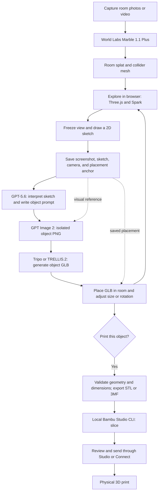

# Print the World

Hackathon concept, architecture, and API research · September 5, 2026

## The idea

Capture the room you are standing in, explore a generated 3D version of it, and sketch objects into your view. AI turns each sketch into an isolated object image, then a 3D model that appears in the room. If you like the object, prepare it for a physical 3D print.

Example: walk around a digital version of your room, draw a plant pot beside a desk, and type “a small terracotta planter with vertical ribs.” Generate it, adjust its placement and dimensions, inspect it from different angles, and print a suitable version. A couch follows the same visualization workflow; printing it would mean a miniature or separately designed components.

**Recommended MVP:** a laptop browser app using **Three.js + Spark**, **World Labs Marble 1.1 Plus** for the room, **GPT-5.6 Sol** for interpreting the sketch, **GPT Image 2** for the object image, and **Tripo H3.1** for the object mesh. Use **Bambu Studio CLI** for slicing through a local backend, with a Studio/Connect handoff for print initiation. Use hosted **TRELLIS.2 on fal** as the alternative mesh provider.

These recommendations prioritize integration fit for this hackathon. They are based on public vendor documentation, not a measured comparison of output quality. Account access, latency, and printer compatibility still need a small end-to-end trial.

## Application flow

Room generation happens once per capture. Object generation repeats while the same room remains loaded. The app saves a scene containing the original splat plus separate object meshes and their transforms.

## API and tool choices

| Component | Recommended choice | Why it fits / limitation |
| --- | --- | --- |
| Room generation | World Labs `marble-1.1-plus` | Latest documented Marble model; listed in the public World API. `marble-1.1` is a fixed-cost alternative. Explicitly set the model because the documented API default remains older. [Model mapping](https://docs.worldlabs.ai/api/models), [model descriptions](https://docs.worldlabs.ai/marble/models). |
| Room rendering and object composition | Three.js + `@sparkjsdev/spark` | Spark integrates splats into a Three.js scene. Load object GLBs with Three.js `GLTFLoader`. [Spark](https://sparkjs.dev/docs/), [GLTFLoader](https://threejs.org/docs/pages/GLTFLoader.html). |
| Sketch interpretation | OpenAI `gpt-5.6-sol` | Supports image inputs and structured outputs through Responses. The `gpt-5.6` alias maps to Sol. [Model documentation](https://developers.openai.com/api/docs/models/gpt-5.6-sol). |
| Object image | OpenAI `gpt-image-2` | Latest documented GPT Image model. Transparent backgrounds are available in **preview**; request the API setting explicitly. [Image generation guide](https://developers.openai.com/api/docs/guides/image-generation). |
| Object mesh | Tripo H3.1, `v3.1-20260211` | Supports image-to-model, source-image orientation alignment, and geometry controls. Its conversion API supports STL and 3MF. [H3 parameters](https://docs.tripo3d.ai/model-generation/image-to-model-v3-0-v3-1.html), [conversion](https://docs.tripo3d.ai/export/conversion.html). |
| Alternative object mesh | `fal-ai/trellis-2` | Hosted image-to-GLB endpoint with queue support; avoids maintaining a GPU environment. [API](https://fal.ai/models/fal-ai/trellis-2/api). |
| Optional platform | Mint | Offers World and 3D Model generation and downloadable assets. The API overview currently labels access **beta** and requires enablement. Avoid making this a dependency unless the team already has access. [Mint API](https://docs.mint.gg/developers/api-overview). |
| Print preparation | Local Bambu Studio CLI | Documents slicing and 3MF export. Treat printer dispatch as a separate integration. [CLI documentation](https://github.com/bambulab/BambuStudio/wiki/Command-Line-Usage). |

**Why Tripo first:** its alignment and export controls match the two difficult transitions: putting the generated asset back into the saved view and preparing a print file. Compare it with TRELLIS.2 using the same planter image before committing to one provider for the demo.

**Why Spark for insertion:** the object can remain an ordinary editable mesh in the same scene as the splat. No additional generation API is needed to “merge” it into the room. World Labs also documents interactive examples combining splats, dynamic meshes, controllers, and physics. [Interactive world examples](https://docs.worldlabs.ai/api/interactive-world-examples).

**Where Mint could help:** its mobile app offers guided room photos and a guided video sweep. This could simplify capture if already available to the team. Its documented generation API does not, by itself, establish an embeddable editor for inserting arbitrary GLBs into our own saved room; our app should own that composition. [Mobile capture](https://docs.mint.gg/mobile-capture), [API overview](https://docs.mint.gg/developers/api-overview).

**Why avoid local TRELLIS.2 for this MVP:** Microsoft's reference implementation is tested on Linux and requires an NVIDIA GPU with at least 24 GB VRAM. Its published timing measurements are on an H100, not a laptop or a hosted-service latency guarantee. [Official TRELLIS.2 repository](https://github.com/microsoft/TRELLIS.2).

## The nine-step experience

### 1. Capture the hackathon room

Start with an iPhone video uploaded to the laptop app. Record a steady sweep from one useful location, covering the area where the demo will happen. Keep exposure and zoom fixed and minimize moving people in frame. World Labs recommends continuous, rotation-focused capture covering 180–360 degrees. [Video guidance](https://docs.worldlabs.ai/marble/create/prompt-guides/video-prompt).

Target an MP4 of at most 30 seconds and 100 MB, matching the published Marble input guidelines; validate the selected API's accepted upload constraints during integration. A full panorama must be a 360-degree equirectangular image, not an ordinary partial phone panorama. [Input specifications](https://docs.worldlabs.ai/marble/create/prompt-guides).

Keep a few sharp stills as a fallback. Multi-image input works best when the views describe the same space with overlap. Hidden areas can be generated plausibly, so a walkable result should be treated as a visual approximation of the room. Check recognizable furniture and measure one reference distance before relying on scale. [Multi-image guidance](https://docs.worldlabs.ai/marble/create/prompt-guides/multi-image-prompt).

### 2. Generate and store the room

The backend uploads the capture, starts a world-generation job, and polls until completion. Save the world ID, selected model, original input, and returned assets. The World API provides SPZ splats at several resolutions and a GLB collider mesh. Start with the 500k splat on the laptop and try the 100k version on the phone. [World API quickstart](https://docs.worldlabs.ai/api).

Normalize the room before placing anything. Marble returns `metric_scale_factor` and `ground_plane_offset`; apply these to splat positions and sizes using the documented formula, then apply the renderer's axis conversion. Its viewer uses a 180-degree X rotation for generated SPZ assets. Save this transform with the project. Verify collider alignment separately so a mesh already in a different export frame is not transformed twice. [SPZ rendering guidance](https://docs.worldlabs.ai/api/rendering-spz).

The room's collider is useful for picking surfaces and walking constraints. Detailed textured room-mesh export is unnecessary for the core demo.

### 3. Explore, then draw on the screen

Use a React/TypeScript interface with a Three.js canvas and a transparent 2D canvas above it. This is a proposed implementation, not a provider requirement.

- **Explore:** mouse look and keyboard movement on laptop; touch look and a movement control on phone.
- **Draw:** freeze the camera, release pointer lock, and route input to the overlay. Provide pen, eraser, undo, and clear.
- **Generate:** attach an optional short description and submit the saved sketch.
- **Adjust:** move, rotate, resize, delete, or regenerate the resulting object.

Keep each sketch attached to one frozen view. Resizing the viewport should preserve its original dimensions and stroke coordinates. Start with simple navigation; add collider-based walking if time permits.

### 4. Save the view and drawing

Save the composited screenshot the user described, plus enough information to restore it and place an object later:

| Saved field | Purpose |
| --- | --- |
| `worldId` and world transform/version | Identifies the room and its coordinate frame. |
| Clean scene image | Preserves context without marks. |
| Transparent sketch PNG and stroke data | Keeps the intended shape separate from existing furniture. |
| Composite PNG | Exact view with drawing for model interpretation and history. |
| Camera position, quaternion, projection matrix/FOV | Restores the original perspective. |
| Viewport dimensions and device pixel ratio | Maps drawing pixels back to camera rays. |
| Sketch bounds and a chosen contact point | Indicates object extent and where it should touch a surface. |
| Placement anchor, surface normal, and anchor method | Supplies depth and supports repeatable positioning. |
| User text and intended dimensions, if known | Preserves intent independently of AI-generated wording. |

Capture the scene and overlay at the same resolution and frame. Use a deliberate render capture; confirm it includes both splats and previously placed objects. Store the composite as a reference image, not as the only project state.

### 5. Interpret the sketch and generate the object image

Send the composite, separate sketch, and user text to GPT-5.6 Sol. Ask for structured output containing `object_description`, `image_prompt`, `support_surface`, `suggested_dimensions_m`, and `uncertainties`. Suggested dimensions are a starting point; the user controls final size.

Then call the Images edit endpoint with the visual reference and generated prompt, so the drawing actually conditions the image. Use `model: "gpt-image-2"`, `background: "transparent"`, `output_format: "png"`, and initially `size: "1024x1024"`. Omit `input_fidelity` for this model. [Image API guidance](https://developers.openai.com/api/docs/guides/image-generation).

Proposed prompt pattern:

> Create one isolated object matching the user's sketch: {description}. Use the room only to understand style and the intended object. Show the complete object in a clear three-quarter product view, centered with margin. Preserve the sketch's defining silhouette and proportions. Use a transparent background. Exclude the room, floor, other furniture, text, and cast shadows.

Show the image for review before the 3D step. Check the decoded alpha channel: a checkerboard painted into an opaque image is not transparency. If needed, remove the background with a separately tested segmentation step and review the silhouette. The saved room screenshot remains the context; the isolated cutout becomes the 3D model input. A small rotation adjustment may be necessary because a product view differs from the original camera view.

### 6. Turn the image into a 3D object

Send the generated **image**, rather than just its text prompt, to image-to-3D. The result should be an object mesh, not a reconstruction of the entire screenshot.

For Tripo, start with H3.1, texturing enabled, standard quality, and `orientation: "align_image"`. This aligns to the supplied object image, not automatically to our room camera. Keep the GLB for display and create an STL/3MF derivative only when printing. [Image-to-model parameters](https://docs.tripo3d.ai/model-generation/image-to-model-v3-0-v3-1.html).

For fal's TRELLIS.2 alternative, the contract is `image_url` in and `model_glb.url` out. Its queue API supports asynchronous jobs. Begin with reduced mesh complexity for the browser and retain a higher-detail version if available. [Hosted TRELLIS.2 API](https://fal.ai/models/fal-ai/trellis-2/api).

Copy completed assets into project storage promptly. Tripo's task-result documentation says its model download URLs expire after five minutes by default; persisting only those URLs would break saved projects. [Task results](https://docs.tripo3d.ai/task-query/get-your-task-result.html).

### 7. Place the GLB in the room

This is application geometry work. A screenshot and camera pose define a viewing ray, but they do not uniquely specify distance.

Proposed placement algorithm:

1. Before generation, let the user choose the sketch's base/contact point.
2. Cast a ray from the saved camera through that point into the collider mesh. Save the hit position and surface normal.
3. If the collider hit is missing or wrong, offer a floor plane or manual distance adjustment. Spark also supports splat raycasts, but these are approximate and can be expensive on large scenes. [SplatMesh raycasting](https://sparkjs.dev/docs/splat-mesh/).
4. Normalize the object's axes and pivot. Place its bottom center at the saved anchor.
5. Use the selected dimensions to scale the model. When dimensions are unknown, estimate initial size from sketch bounds and anchor depth.
6. Provide explicit translation, rotation, and scale controls to correct the result.
7. Persist the final transform, asset ID, and original sketch ID.

Keep splats, collider, camera, and objects in a documented common coordinate system. Test near a desk or wall: matching transforms is not sufficient by itself to guarantee convincing occlusion. Tune mesh/splat depth behavior and inspect silhouettes; add a carefully configured depth proxy only if needed. Spark exposes depth/compositing controls and scene capture facilities. [SparkRenderer](https://sparkjs.dev/docs/spark-renderer/).

### 8. Inspect and keep editing

The user walks around the object, returns to the original sketch view, changes its dimensions, or generates another version. Store each accepted object separately so deleting or replacing one does not affect the room.

For a fast-feeling demo, show the sketch immediately, then the isolated image while the mesh job runs. A temporary image card can be shown at the anchor, clearly labeled as a preview. Replace it with the GLB when ready. Reopening a project must restore the objects without rerunning any generation.

### 9. Prepare and print a physical version

The **Print** action starts a preparation workflow: choose dimensions in millimeters, validate geometry, export a printable mesh, slice with the actual printer/material profile, review the result, and initiate the print.

An attractive generated mesh is not automatically a functional planter. Check for a hollow interior, adequate wall and base thickness, a stable base, and intentional drainage. For the demo, choose a small simple object and inspect the sliced layers. Keep the printable derivative separate from the visual GLB, and preview any geometry changes back in the app.

Tripo can convert to STL or geometry-only 3MF; STL drops textures. Conversion alone does not establish printability. Apply the chosen object scale deliberately and verify units after export. [Conversion API](https://docs.tripo3d.ai/export/conversion.html).

A browser cannot directly execute a desktop CLI. Run a small local backend on the laptop to invoke Bambu Studio with fixed, validated arguments. The CLI supports profiles, orientation, arrangement, slicing, and 3MF export. Test the installed binary with `--help` and a known object before integrating generated meshes. [Bambu Studio CLI](https://github.com/bambulab/BambuStudio/wiki/Command-Line-Usage).

**MVP handoff:** the app prepares the file and opens it in Bambu Studio for review and sending. Bambu Connect is another documented route for delivering sliced files and initiating prints; availability and integration depend on the actual printer/software setup. Fully automatic dispatch is a stretch goal requiring a tested supported path, not an assumed CLI `--print` option. [Bambu integration documentation](https://blog.bambulab.com/firmware-update-introducing-new-authorization-control-system-2/).

## Backend boundaries and API contracts

Use a small local Node/TypeScript server for provider calls, persistent job state, asset downloads, and the print bridge. SQLite plus local files is sufficient for the first laptop demo. Add object storage only when needed for provider-readable URLs or cross-device access. Keep API keys on the server.

| Service | Documented interaction |
| --- | --- |
| World Labs | Base `https://api.worldlabs.ai`; authenticate with `WLT-Api-Key`. Prepare an upload, submit `POST /marble/v1/worlds:generate`, poll `GET /marble/v1/operations/{id}`, and retrieve the world. [Quickstart](https://docs.worldlabs.ai/api). |
| OpenAI interpretation | `POST /v1/responses` with `gpt-5.6-sol`, image inputs, and a structured output schema. [Model](https://developers.openai.com/api/docs/models/gpt-5.6-sol). |
| OpenAI image | `POST /v1/images/edits` with reference image(s), generated prompt, and transparent PNG options. [Guide](https://developers.openai.com/api/docs/guides/image-generation). |
| Tripo | The established task API uses `POST https://api.tripo3d.ai/v2/openapi/task`, Bearer authentication, and `GET /v2/openapi/task/{id}`. Select `type: "image_to_model"` with H3.1. [Authentication and tasks](https://docs.tripo3d.ai/get-started/quick-start.html). |
| fal alternative | Submit `fal-ai/trellis-2` with the server SDK; persist the request ID, poll status, and retrieve the result. [API](https://fal.ai/models/fal-ai/trellis-2/api). |

Tripo also publishes a v3 developer surface. Choose one documented API family and keep its request fields and response parser together; do not mix the v2 `model_version` task payload with v3 examples using `model`. [v3 image-to-model documentation](https://developers.tripo3d.ai/en/docs/generation-image-to-model).

Suggested internal records: `Project`, `World`, `Sketch`, `GenerationJob`, `ObjectAsset`, `SceneObject`, and `PrintJob`. Record provider IDs, model versions, timestamps, settings, errors, and local asset paths. The frontend should poll our server or receive progress events instead of holding one long request open through every stage.

Persist successful stages independently. Retry from the failed stage, and avoid duplicate paid jobs when a client reconnects. Treat print submission separately: a network retry must not accidentally dispatch a second physical print.

For iPhone access, serve the same responsive interface from the laptop or a hosted backend. File upload can be the initial capture path; direct browser camera capture needs an appropriate secure origin. Native iOS/AR features can follow once the laptop loop works.

## Cost and latency planning

Published prices below were checked September 5, 2026. They exclude retries, storage, and physical printing.

| Stage | Published cost / planning note |
| --- | --- |
| Marble 1.1 Plus, video or multi-image | 1,600–3,100 API credits, or **$1.28–$2.48** at 1,250 credits/$1. World API credits are separate from Marble app credits. [API pricing](https://docs.worldlabs.ai/api/pricing). |
| GPT-5.6 Sol | Currently $4/M input tokens and $20/M output tokens; actual cost depends on image input and response usage. [Model pricing](https://developers.openai.com/api/docs/models/gpt-5.6-sol). |
| GPT Image 2, 1024-square output | Output-only reference prices: **$0.006 low, $0.053 medium, $0.211 high**. Add text/image input usage. [Image cost table](https://developers.openai.com/api/docs/guides/image-generation). |
| Tripo H3 image-to-model | **$0.20 without texture / $0.30 with texture** at 100 credits/$1. Extra settings can add charges; conversion starts at $0.05. [Pricing](https://docs.tripo3d.ai/get-started/pricing.html). |
| fal TRELLIS.2 alternative | **$0.25 / $0.30 / $0.35** for 512/1024/1536 resolution settings. [Provider pricing](https://fal.ai/models/fal-ai/trellis-2). |

For a medium image plus standard textured Tripo generation, the published base is about **$0.353 per attempt**, before OpenAI input/interpretation costs and any conversion. This is a planning subtotal, not a quoted all-in price.

World Labs' quickstart suggests roughly five minutes for world generation. OpenAI notes that complex image requests can take up to two minutes. No end-to-end timing was tested here. Budget minutes for the complete object loop until measured, and generate the demo room ahead of the presentation. [World generation](https://docs.worldlabs.ai/api), [image limitations](https://developers.openai.com/api/docs/guides/image-generation).

## Build order and completion criteria

1. **Validate dependencies:** confirm API access/credits, capture the room, generate one world, and obtain one sample GLB. Check the printer model, nozzle, filament, and Bambu Studio installation.
2. **Prove composition:** display the room with one manually placed GLB; verify axes, scale, depth behavior, and navigation on the demo laptop.
3. **Build drawing and persistence:** freeze the view, draw, save the reference bundle, reload it, and restore the exact camera view.
4. **Connect AI generation:** interpret the sketch, generate and inspect the cutout, create a mesh, download it, and place it at the saved anchor.
5. **Complete printing:** choose explicit dimensions, prepare a suitable object, slice it, inspect the result, and successfully print it through the tested handoff.
6. **Add polish:** progress states, retry controls, object history, touch controls, and a prerecorded fallback if venue connectivity fails.

The core demo is complete when a real capture of this room is navigable, a new sketch becomes an independently placed 3D object, the scene survives reload, and one suitable object reaches a real print. A native iOS app, exact architectural reconstruction, automatic hollowing of arbitrary meshes, and unattended print dispatch are later extensions.

The highest-value first test is one complete planter run. It will expose the actual capture fidelity, image alpha behavior, mesh quality, placement mismatch, generation latency, and printing work before the team spends time polishing the interface.
